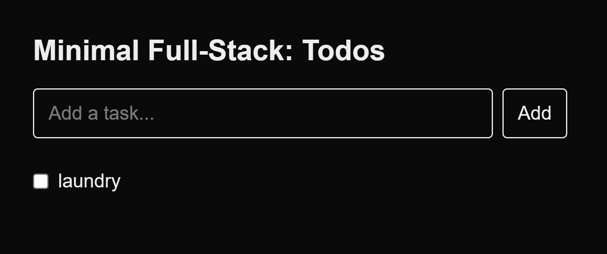

# Minimal Full-Stack Example (Next.js + SQLite)



This is a minimalistic full-stack application built with **Next.js**, **Prisma**, and **SQLite**.  
It demonstrates how frontend, backend, and a database can work together in one project.

---

## Features
- ✅ Add todos
- ✅ List todos
- ✅ Toggle todo as done/undone
- ✅ Data stored in SQLite using Prisma ORM
- ✅ Minimal API routes in Next.js

---

## Getting Started

### 1. Create project
```bash
npx create-next-app@latest minimal-fullstack --typescript --eslint
cd minimal-fullstack
npm i @prisma/client prisma
npx prisma init --datasource-provider sqlite
```

### 2. Database setup
Edit `prisma/schema.prisma` to define a simple `Todo` model, then run:
```bash
npx prisma migrate dev --name init
```

### 3. API routes
The backend routes live inside `app/api/todos/route.ts`.  
They allow you to:
- `GET /api/todos` → fetch all todos
- `POST /api/todos` → add a new todo
- `PATCH /api/todos` → toggle a todo done/undone

### 4. Frontend
Replace `app/page.tsx` with a minimal React component to display and manage todos.

### 5. Run locally
```bash
npm run dev
# open http://localhost:3000
```

---

## Screenshot
The app looks like this:


---

## Stack
- [Next.js](https://nextjs.org/) – frontend + backend framework
- [Prisma](https://www.prisma.io/) – database ORM
- [SQLite](https://sqlite.org/) – simple file-based database

---

## Optional Improvements
- 🔑 Add authentication (e.g., NextAuth with Google login)
- ☁️ Deploy to Vercel
- 🗂 Add user-specific todos

---

Made as a learning project for a **minimal full-stack app**. 🚀
